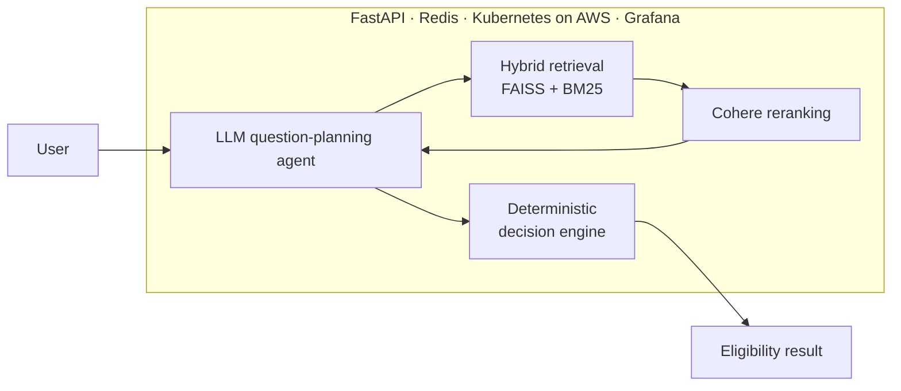

<!-- Header -->

  

  

  
  
  

---

### 👋 About me

I'm an AI/ML engineer in San Francisco and a UC Berkeley MIDS grad. I build LLM and retrieval systems, and the backend and infrastructure that make them reliable in production.

- 🔍 **Focus:** RAG, LLM agents, evaluation, and production ML services
- 🛠️ **Background:** full stack and backend engineering on AWS
- 📷 **Off the keyboard:** landscape photography around California

---

### 🚀 Featured projects

| Project | What it does | Stack |
|---|---|---|
| **[MedCoverage](https://github.com/fardaevm/MedCoverage)** | Medi-Cal eligibility assistant: an LLM agent gathers user details, hybrid retrieval grounds answers in policy documents, and a deterministic decision engine keeps outcomes auditable | `FastAPI` `FAISS` `BM25` `Cohere` `LanceDB` `Redis` `Kubernetes` `Grafana` |
| **[Leazeard](https://github.com/fardaevm/leazeard)** | Lease risk analysis over San Francisco housing ordinances with clause-level risk flags and tenant recommendations | `LangGraph` `RAG` `Python` |
| **[SkyPredict]** | Flight delay prediction on 840M+ weather and aviation records; AUC 0.61 → 0.79 | `PySpark` `Spark ML` `SQL` |
| **[Vizomaly](https://github.com/fardaevm/Vizomaly)** | Unsupervised industrial anomaly detection with pixel-level defect localization | `PyTorch` `DINOv2` `ViT` |
| **[IgnisAI](https://github.com/fardaevm/ignisai)** | California wildfire risk modeling from satellite and weather data | `scikit-learn` `SMOTE` `Geospatial` |

<b>🧭 How MedCoverage works</b> (click to expand)

---

### 🧰 Tech stack

**Languages & ML**

  

**LLM & AI**

  
  
  
  
  
  
  

**Backend, Cloud & MLOps**

  

---

  

