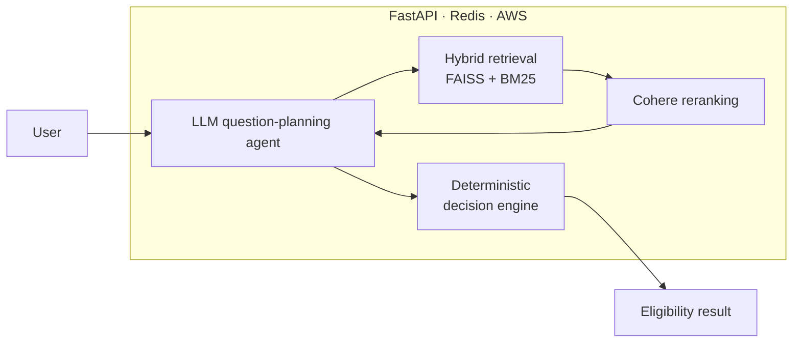
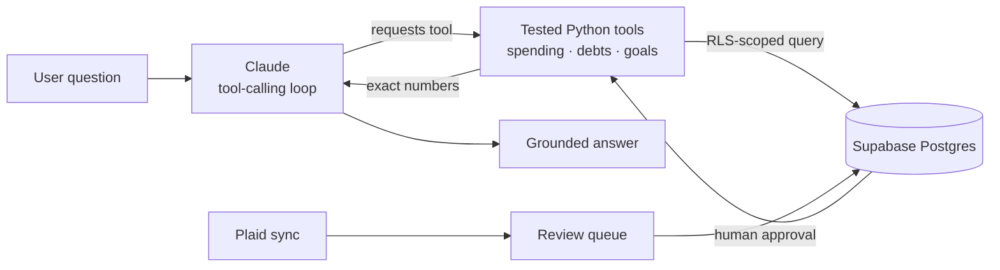

<!-- Header -->
  
 
  
 
      

---

### About me

-  **UC Berkeley MIDS** (Master of Information and Data Science), GPA 3.97
-  **2+ years of production ML engineering**, with a backend and full-stack foundation on AWS
-  **Focus:** RAG and hybrid retrieval, tool-calling LLM agents, evaluation, and deploying ML services that stay reliable after launch
-  **How I work:** keep the model out of anything that must be exactly right. Retrieval grounds answers, deterministic code does the math and the decisions, and tests cover both.

---

### Featured projects

| Project | What it does | Stack |
|---|---|---|
| **[MedCoverage](https://github.com/fardaevm/MedCoverage)** | Medi-Cal eligibility assistant. I built the RAG system, the LLM question-planning agent, the decision-tree logic, Redis caching, and the full AWS deployment. Hybrid retrieval grounds answers in policy documents, and a deterministic decision engine keeps outcomes auditable. | `FastAPI` `FAISS` `BM25` `Cohere` `LanceDB` `Redis` `AWS` |
| **[Ledger](https://github.com/fardaevm/ledger-app)** · [Live ↗](https://ledger-app-mocha-nine.vercel.app) | Shared household finance app in daily use. A hand-built tool-calling agent answers questions using only unit-tested Python functions (the model never does arithmetic), Plaid bank sync lands in a human-review queue before anything reaches the ledger, and Postgres row-level security is the authorization boundary. | `Claude API` `FastAPI` `Supabase` `Postgres` `Plaid` `Vercel` |
| **[Leazard](https://github.com/fardaevm/leazard)** | Lease risk analysis over San Francisco housing ordinances, with clause-level risk flags and tenant recommendations. | `LangGraph` `RAG` `Python` |
| **[Vizomaly](https://github.com/fardaevm/Vizomaly)** | Unsupervised industrial anomaly detection with pixel-level defect localization. | `PyTorch` `DINOv2` `ViT` |
| **[IgnisAI](https://github.com/fardaevm/Ignis-AI-WildFire)** | California wildfire risk modeling from satellite and weather data. | `scikit-learn` `SMOTE` `Geospatial` |

<b> How MedCoverage works</b>

<b>How Ledger's agent works</b>

Every number the assistant states comes from a tool call, not from the model. The agent queries with the user's own JWT, so it can never see more than the user can.

---

### Skills

**ML & Data:** Python · SQL · PyTorch · TensorFlow · scikit-learn · PySpark · Pandas · Hugging Face · Vision Transformers

**LLM & Retrieval:** RAG · hybrid search (FAISS, BM25) · reranking (Cohere) · LanceDB · LangChain · LangGraph · tool-calling agents · OpenAI and Anthropic APIs · LLM evaluation

**Backend & MLOps:** FastAPI · PostgreSQL · Redis · Docker · Kubernetes · AWS · GCP · GitHub Actions · Grafana · CI/CD · Vercel

  

---

### Let's talk

I'm actively interviewing for ML, AI, and MLOps engineering roles. The fastest way to reach me is [LinkedIn](https://www.linkedin.com/in/ali-fardaev) or [fardaevali@gmail.com](mailto:fardaevali@gmail.com).

  

